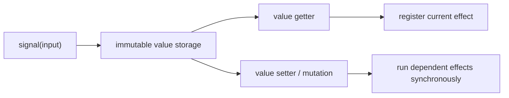
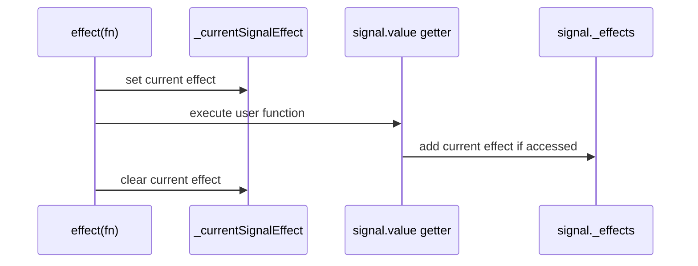
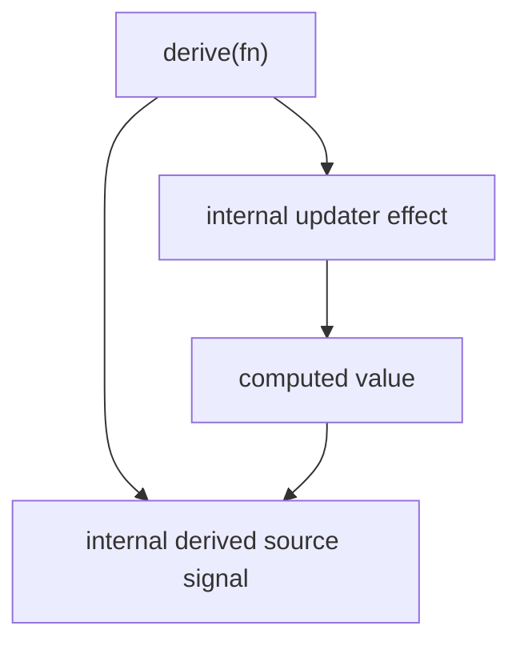
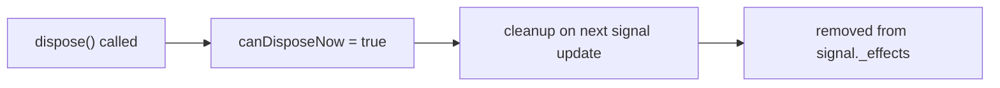
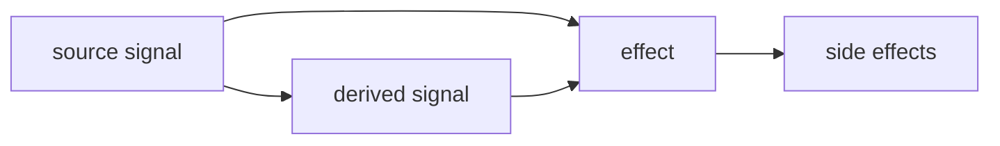

# Architecture

## 1. Core Runtime

The core runtime is small on purpose:
- `signal()` creates mutable source state
- reading `.value` adds the current effect to the signal
- writing `.value` or mutating arrays/objects triggers dependent effects immediately

## 2. Dependency Tracking

Tracking is global and temporary:
- `effect()` sets a module-level current effect before executing the callback
- each signal getter registers that effect in the signal's local `_effects` set
- when execution ends, the current effect is cleared

## 3. Derived Signal Model

Derived signals are not a separate storage engine:
- they are implemented using an internal source signal
- an internal effect recomputes the value
- the public derived signal exposes read-only `.value`, `prevValue`, and `dispose()`

## 4. Disposal

Disposal is intentionally lazy:
- calling `dispose()` marks the effect
- the effect is removed on the next update cycle
- this keeps disposal simple and synchronous with the rest of the runtime

## 5. Data Flow

The actual data flow is:
1. a source signal stores state
2. derived signals read source signals and recompute immediately
3. effects observe signals by reading `.value`
4. updates propagate synchronously through the dependency set

## 6. Internal State

- Source signals store `_value` and `_effects`
- Effects store `canDisposeNow` and `dispose()`
- Derived signals store an internal source signal plus an updater effect
- Array and object signals add shape-specific helpers on top of the same source signal core

## 7. Why This Design

- It keeps the runtime small and explicit
- It avoids hidden batching or deferred execution
- It matches the repository's semantics and behavioral tests exactly
- It makes the signal graph easy to reason about because every dependency comes from an actual getter read

