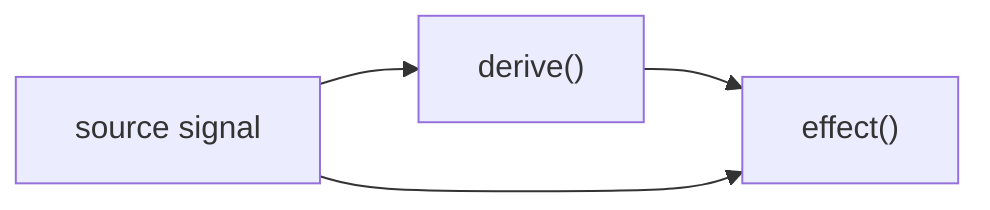

# Tutorial

## 1. Install

```ts
import { signal, derive, effect } from "@cyftech/signal";
```

Expected result:
- the library imports cleanly
- the three primitives are available immediately

## 2. Create State

```ts
const count = signal(0);
console.log(count.value); // 0
count.value = 1;
console.log(count.value); // 1
```

What changed:
- `signal()` stores mutable state
- `.value` reads and writes the current value

## 3. Read From State

```ts
const name = signal("Ada");
console.log(`Hello, ${name.value}`);
```

Expected result:
- output reads the current signal value directly

## 4. Derive State

```ts
const count = signal(2);
const doubled = derive(() => count.value * 2);
console.log(doubled.value); // 4
```

What changed:
- `derive()` computes new state from existing state
- the result stays in sync automatically

## 5. React To Changes

```ts
const count = signal(0);
effect(() => {
  console.log("count:", count.value);
});
count.value = 1;
```

Expected result:
- the effect runs once immediately
- it runs again after the update

## 6. Combine Signals

```ts
const first = signal("Ada");
const last = signal("Lovelace");
const fullName = derive(() => `${first.value} ${last.value}`);
effect(() => {
  console.log(fullName.value);
});
```

## 7. Pattern to Prefer

- Use `signal()` for mutable source data
- Use `derive()` for computed values
- Use `effect()` for logging, DOM updates, and integration points

## 8. Mental Model



Use this when you want the shortest path from state to UI.

## 9. Equality Short-Circuit

```ts
const count = signal(1);
effect(() => {
  console.log(count.value);
});
count.value = 1;
```

Expected result:
- the effect does not re-run for the same value

## 10. Dispose When Done

```ts
const count = signal(0);
const logger = effect(() => {
  console.log(count.value);
});

logger.dispose();
count.value = 1;
```

Expected result:
- the disposed effect does not run again after the next update cycle

## 11. Arrays And Objects

```ts
const items = signal([1, 2, 3]);
items.push(4);

const user = signal({ name: "Ada", age: 36 });
user.set({ age: 37 });
```

Expected result:
- array helpers update the array signal
- object `set()` performs a shallow merge
